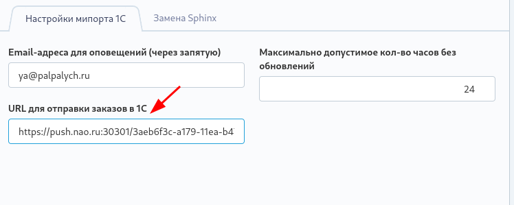

# 1c-exchange
В крон есть две команды:
`artisan catalog:checkimport >/dev/null 2>&1` - Проверить последний импорт и отправить уведомление (раз в 4 часа днем)
`artisan shop:push1c.order >/dev/null 2>&1` - Отправка заказа в 1С (раз в 2 минуты) по адресу из админки

## Протокол обмена с сайтом

Обмен электронными документами осуществляется в соответствии с правилами и форматами, описанными в стандарте **CommerceML 2**.

При инициализации взаимодействия устанавливается HTTP соединение. Система «1С: Предприятие» запрашивает у сайта необходимые параметры, такие, как максимальный объем пакета, поддержка сжатия и др. На основании этих данных система 1С: Предприятие формирует XML сообщения и передает их на сайт.

### Выгрузка на сайт (взято из документации 1с)
Данные для публикации на сайте выгружаются одним пакетом.

**A. Начало сеанса**
Выгрузка данных начинается с того, что система «1С: Предприятие» отправляет http-запрос следующего вида: 
`http://<сайт>/<путь> /1c_exchange.php? type=catalog& mode=checkauth`

В ответ система управления сайтом передает системе «1С: Предприятие» три строки (используется разделитель строк «\n»):
- слово «success»;
- имя Cookie;
- значение Cookie.
**Примечание**. Все последующие запросы к системе управления сайтом со стороны «1С: Предприятия» содержат в заголовке запроса имя и значение Cookie.

**B. Запрос параметров от сайта**
Далее следует запрос следующего вида: 
`http://<сайт>/<путь> /1c_exchange.php? type=catalog& mode=init`

В ответ система управления сайтом передает две строки:
`zip=yes`, если сервер поддерживает обмен в zip-формате —  в этом случае на следующем шаге файлы должны быть упакованы в zip-формате
или
`zip=no` — в этом случае на следующем шаге файлы не упаковываются и передаются каждый по отдельности.
`file_limit=<число>`, где <число> — максимально допустимый размер файла в байтах для передачи за один запрос. Если системе «1С: Предприятие» понадобится передать файл большего размера, его следует разделить на фрагменты.

**C. Выгрузка на сайт файлов обмена**
Затем «1С: Предприятие» запросами с параметрами вида 
`http://<сайт>/<путь> /1c_exchange.php? type=catalog& mode=file& filename=<имя файла>`
выгружает на сайт файлы обмена в формате CommerceML 2, посылая содержимое файла или его части в виде POST.

В случае успешной записи файла система управления сайтом выдает строку *«success»*.

**D. Пошаговая загрузка данных**
На последнем шаге по запросу из «1С: Предприятия» производится пошаговая загрузка данных по запросу с параметрами вида 
`http://<сайт>/<путь> /1c_exchange.php? type=catalog& mode=import& filename=<имя файла>`

Во время загрузки система управления сайтом может отвечать в одном из следующих вариантов.
Если в первой строке содержится слово *«progress»* — это означает необходимость послать тот же запрос еще раз. В этом случае во второй строке будет возвращен текущий статус обработки, объем  загруженных данных, статус импорта и т. д.
Если в ответ передается строка со словом *«success»*, то это будет означать сообщение об успешном окончании обработки файла.

**Примечание**. Если в ходе какого-либо запроса произошла ошибка, то в первой строке ответа системы управления сайтом будет содержаться слово *«failure»*, а в следующих строках — описание ошибки, произошедшей в процессе обработки запроса. Если произошла необрабатываемая ошибка уровня ядра продукта или sql-запроса, то будет возвращен html-код.

### Обмен информацией о заказах

#### Последовательность действий при работе с заказом:

**A. Начало сеанса**
Выгрузка данных начинается с того, что система «1С: Предприятие» отправляет http-запрос следующего вида: 
`http://<сайт>/<путь> /1c_exchange.php? type=sale& mode=checkauth`

В ответ система управления сайтом передает системе «1С: Предприятие» три строки (используется разделитель строк «\n»):
- слово «success»;
- имя Cookie;
- значение Cookie.
**Примечание**. Все последующие запросы к системе управления сайтом со стороны «1С: Предприятия» содержат в заголовке запроса имя и значение Cookie.

**B. Уточнение параметров сеанса**
Далее следует запрос следующего вида: 
`http://<сайт>/<путь> /1c_exchange.php? type=sale& mode=init`

В ответ система управления сайтом передает две строки:
`zip=yes`, если сервер поддерживает обмен в zip-формате —  в этом случае на следующем шаге файлы должны быть упакованы в zip-формате
или
`zip=no` — в этом случае на следующем шаге файлы не упаковываются и передаются каждый по отдельности.
`file_limit=<число>`, где <число> — максимально допустимый размер файла в байтах для передачи за один запрос

**C. Получение файла обмена с сайта**
Затем на сайт отправляется запрос вида
`http://<сайт>/<путь> /1c_exchange.php? type=sale& mode=query`

Сайт передает сведения о заказах в формате CommerceML 2. В случае успешного получения и записи заказов «1С: Предприятие» передает на сайт запрос вида 
`http://<сайт>/<путь> /1c_exchange.php? type=sale& mode=success`

**D. Отправка файла обмена на сайт**
Затем система «1С: Предприятие» отправляет на сайт запрос вида 
`http://<сайт>/<путь> /1c_exchange.php? type=sale& mode=file& filename=<имя файла>`
который загружает на сервер файл обмена, посылая содержимое файла в виде POST.

В случае успешной записи файла система управления сайтом передает строку со словом *«success»*. Дополнительно на следующих строчках могут содержаться замечания по загрузке.

**Примечание**. Если в ходе какого-либо запроса произошла ошибка, то в первой строке ответа системы управления сайтом будет содержаться слово *«failure»*, а в следующих строках — описание ошибки, произошедшей в процессе обработки запроса.
 Если произошла необрабатываемая ошибка уровня ядра продукта или sql-запроса, то будет возвращен html-код.

## Выгрузка информации о товарах на сайт PTK

Выгрузка происходит как описано выше.
Путь выгрузки - `https://ptk-svarka.ru/exchange1c`
Путь выгрузки на тестовом сайте - `https://ptk.u-palpalycha.ru/exchange1c`
Загружаются файлы import.xml (информация о товарах) и offers.xml (информация о предложениях)

Импорт товаров происходит в классе `plugins/palpalych/catalog/models/Import.php`

После импорта задается время последнего импорта, которое используется в команде `check:import`

## Отправка заказов на сайт

Заказы, помеченные на отправку, отправляются через крон команду `shop:push1c.order`

Команда отправляет запрос на сервер, указанный в админке. Также для запросов она использует следующие файлы:
`certs/client01.key` - приватный ssl ключ
`certs/client01.crt` - клиентский ssl сертификат
`certs/ca.crt` - CA bundle

Если заказ экспортируется впервые, то всем менеджерам отправляется уведомление с заголовком **"Новый счет 1С по заказу"**

## Выгрузка информации о заказах

Путь выгрузки на боевом - `https://ptk-svarka.ru/exchange1c`
Путь выгрузки на тестовом сайте - `https://ptk.u-palpalycha.ru/exchange1c`
Выгрузка происходит по тому же алгоритму, что выше, но с отличиями

На этапе получения файла обмена с сайта (mode=query) класс `plugins/palpalych/shop/models/OneCExportOrders.php` формирует список заказов и записывает id отправляемых заказов в сессию пользователя

На следующем этапе (mode=success) заказы с id из сессии помечаются как экспортированные. Следующий этап (mode=file) уже не делает ничего